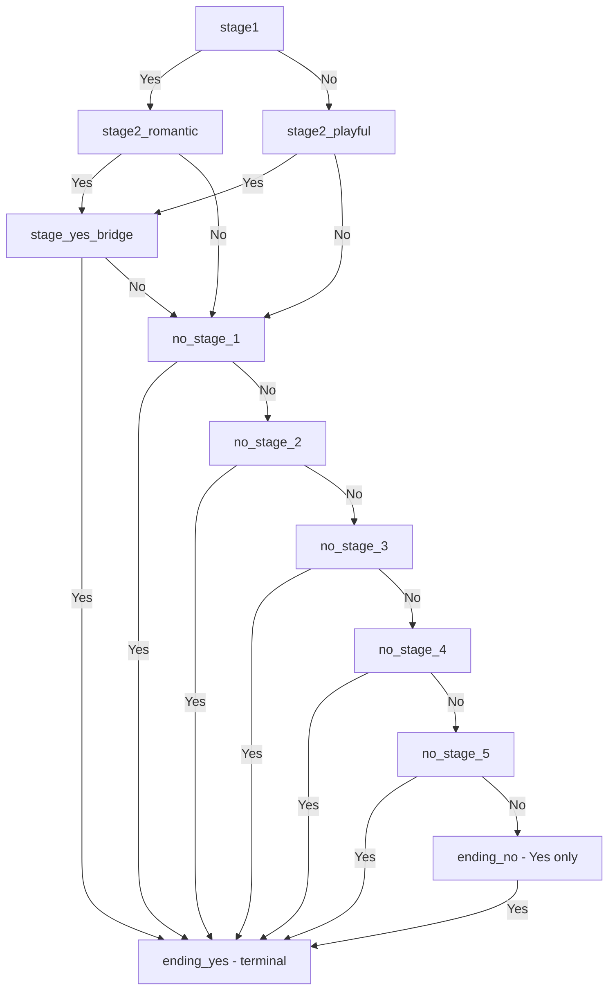

# Infinite Love Story Expansion Plan

## Summary of Changes


| Change      | Description                                                         |
| ----------- | ------------------------------------------------------------------- |
| Yes path    | Insert `stage_yes_bridge` before `ending_yes`                       |
| No path     | Add 5 stages (`no_stage_1` through `no_stage_5`) before `ending_no` |
| ending_no   | **Yes-only stage** — no No button, only Yes leads to `ending_yes`   |
| Witty lines | Support `wittyLines` (array) — engine picks one randomly at render  |
| Images      | Use relative paths `images/{nodeId}.{ext}` for local assets         |


---

## 1. New Story Graph



**Important:** `ending_no` shows only the Yes button (no No button). User reaches it after 5 No stages and must click Yes to proceed to the celebration.


---

## 2. File Changes

### [story.js](story.js)

**Story structure updates:**

- Add `stage_yes_bridge` (between stage2 and `ending_yes`)
- Add `no_stage_1` through `no_stage_5` (No path)
- Update `stage2_romantic` and `stage2_playful`: Yes → `stage_yes_bridge`, No → `no_stage_1`
- Update `stage_yes_bridge`: Yes → `ending_yes`, No → `no_stage_1`
- Chain No stages: no1 → no2 → no3 → no4 → no5 → `ending_no`
- Each No stage: Yes → `ending_yes`, No → next No stage (or `ending_no` for no5)
- **ending_no:** Add `yesOnly: true` — shows only Yes button, no No button. `yes_target`: `ending_yes`, `no_target`: `null` (ignored)

**Image paths:** Use `images/{nodeId}.gif` (e.g. `images/stage1.gif`). User can use `.jpg` or `.png` by changing the extension in the config.

**Witty lines format:** Support both `wittyLine` (string) and `wittyLines` (array). Example:

```javascript
"wittyLines": [
  "You chose love. How perfect.",
  "Love it is. Naturally.",
  "Perfect choice."
]
```

**Validation updates:**

- Treat `wittyLine` or `wittyLines` as valid (at least one required)
- Allow `wittyLines` to be a non-empty array of strings
- For nodes with `yesOnly: true`: `no_target` can be `null`; only `yes_target` is required

### [engine.js](engine.js)

**renderNode (around line 114):**

- When updating the witty line, resolve the value:
  - If `node.wittyLines` exists (array): `wittyEl.textContent = node.wittyLines[Math.floor(Math.random() * node.wittyLines.length)]`
  - Else: `wittyEl.textContent = node.wittyLine`

**handleInteractiveNode (around line 137):**

- If `node.yesOnly === true`:
  - Hide the No button (`noBtn.style.display = "none"`)
  - Assign only `yesBtn.onclick`
  - Do not activate evasive button (there is no No button)
- Else:
  - Show both buttons (`noBtn.style.display = ""` — ensure visible)
  - Assign both click handlers
  - Apply evasive logic on `stage_yes_bridge` and `no_stage_5` (last nodes with both buttons before terminal/yes-only)

**resetButtons:** Ensure `noBtn.style.display = ""` when resetting so the No button reappears on subsequent nodes.

**Evasive logic:** The evasive button activates on `stage_yes_bridge` and `no_stage_5` — the last nodes that have both Yes and No buttons. It does *not* activate on `ending_no` since that stage has no No button.

---

## 3. Image Directory and Naming

Create `images/` at repo root. Naming convention:


| Node ID          | Image path                  |
| ---------------- | --------------------------- |
| stage1           | images/stage1.gif           |
| stage2_romantic  | images/stage2_romantic.gif  |
| stage2_playful   | images/stage2_playful.gif   |
| stage_yes_bridge | images/stage_yes_bridge.gif |
| no_stage_1       | images/no_stage_1.gif       |
| no_stage_2       | images/no_stage_2.gif       |
| no_stage_3       | images/no_stage_3.gif       |
| no_stage_4       | images/no_stage_4.gif       |
| no_stage_5       | images/no_stage_5.gif       |
| ending_yes       | images/ending_yes.gif       |
| ending_no        | images/ending_no.gif        |


User places files with these names. Extensions can be `.gif`, `.jpg`, or `.png` — update the `image` field in the config for each node as needed.

Add a `.gitkeep` in `images/` so the folder exists in the repo even before images are added; user replaces with actual files.

---

## 4. Implementation Order

1. Add `images/` directory with `.gitkeep` and a short `README` or comment in story.js explaining the naming convention
2. Update [story.js](story.js): new nodes, wiring, `yesOnly: true` on `ending_no`, `wittyLines` where desired, and `images/{nodeId}.gif` paths
3. Update validation in [story.js](story.js) for `wittyLine`/`wittyLines` and `yesOnly` nodes
4. Update [engine.js](engine.js): `renderNode` (wittyLines resolution), `handleInteractiveNode` (yesOnly + evasive on correct nodes), `resetButtons` (restore No button visibility)
5. Provide placeholder content for new nodes (user can replace later)

---

## 5. Optional: Fallback for Missing Local Images

If `images/` is empty, images will fail to load. Current [engine.js](engine.js) has `onerror` fallback to an SVG heart. To avoid broken requests, options:

- Keep GIPHY URLs as fallbacks and switch to local paths once images exist, or
- Use local paths and rely on the existing `onerror` SVG fallback

Recommended: use local paths; if a file is missing, the existing fallback will show the heart SVG.